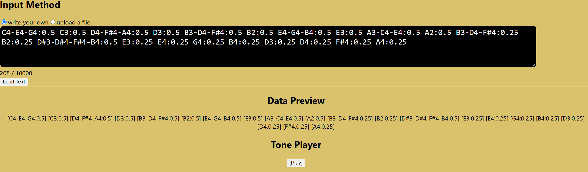
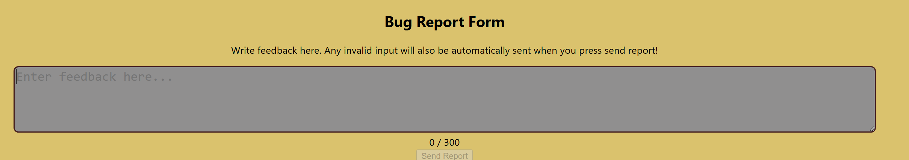
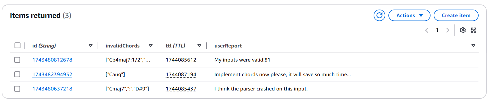

# Parse and Play: Play music from text!
**Parse and Play** is an app built with AWS cloud that converts musical notation into audio playback. 

**Try it yourself here!**: [Parse and Play: Play music from text!](http://parse-and-play.s3-website-ap-southeast-2.amazonaws.com)

## Core Features
- user can input notes and durations like D-F#-A:1/4 (see "Input Formatting")
- user can upload files containing notes
- data preview shows whether each note was parsed or invalid (with the help of regex)
- user can play music using a web audio synth (Tone.js)
- users can submit feedback and, bug reports saved via Lambda Function + DynamoDB

## Technologies Used
- **React.js** => frontend
- **AWS S3** => hosts the static frontend
- **AWS Lambda** => recieves user reports and writes them to DynamoDB
- **AWS DynamoDB** => database that stores user reports (reports auto-delete after 7 days)
- **tone.js package** => web audio synth player

## How to use:
### Input Formatting
| Feature                                      | Example                                                                  |
| -------------------------------------------- | ------------------------------------------------------------------------ |
| Single Notes                                 | C, D, E, F, G, A, B                                                      |
| Accidentals                                  | C`#` or C`b`                                                             |
| Octave                                       | C#`1`, C#`2`, ... C#`7` (defaults to 4 when omitted, range 0–7)          |
| Play a group of notes together (note1-note2) | Use "`-`" to chain notes together: D`-`F#`-`A                            |
| Duration (:number)                           | C`:1/4`, C`:0.25` (C`:1/4` = quarter note, defaults to 1/4 when omitted) |
| Play Nothing (.)                             | `.` or `.`:1/4 etc                                                       |

### Features to be Implemented
- Chords: `maj`, `min`, `dim`, `aug` (for example: `Cmaj`)
- 7th Chords: `maj7`, `min7`, `dim7`, `dom7` (for example: `Cmin7`)
- Complex chord example: `C4maj-B4:1/2`

### Examples
| Name                                         | Notes                                                                                                                                                                                                            |
| -------------------------------------------- | ---------------------------------------------------------------------------------------------------------------------------------------------------------------------------------------------------------------- |
| 4-5-3-6 Japanese Rock Progression            | C4-E4-G4:0.5 C3:0.5 D4-F#4-A4:0.5 D3:0.5 B3-D4-F#4:0.5 B2:0.5 E4-G4-B4:0.5 E3:0.5 A3-C4-E4:0.5 A2:0.5 B3-D4-F#4:0.25 B2:0.25 D#3-D#4-F#4-B4:0.5 E3:0.25 E4:0.25 G4:0.25 B4:0.25 D3:0.25 D4:0.25 F#4:0.25 A4:0.25 |
| Music with some invalid OR unsupported input | Cb4maj7:1/2 .: . C5 C7 .:1/2 D-F#-A .-F#-.:1/4 :                                                                                                                                                                 |

## Screenshots
### Inputting Text and Playing

### Submitting a Report

### Reports stored in DynamoDB Database

## Possible Extensions
- Ability to download .midi or .mp3 files parsed from the input
- Playback ability (ie: pause, ability to jump to any note)
- Deployment on AWS Lightsail when more features are added (but for now, stay in free tier)
- More music tracks (ie: play more than one track at the same time)

## Addendum: 
### Regex Pattern:
- notes: Cb, A#, ., Bb7 etc => noteRegex = "(?:[A-G][b#]?[0-9]?|[.])";
- chained notes: D-F#-A etc => chainedNoteRegex = `((?:${noteRegex}-)*${noteRegex})`
- durations: :1/4, :0.25 etc => durationRegex = "(?:[:]([0-9]+\/[1-9]+|(?:[0-9]*[.])?[0-9]+))?"
- all together => `^${chainedNoteRegex}${durationRegex}`$

### For Future Reference:
### Setting up the Lambda Function
#### Lambda Functions: CORS config
Under Configure Function URL:
- tick Configure cross-origin resource sharing(CORS)
- allow origin: (http://...)
- Allow headers: content-type
- Allow methods (ie GET, POST)

#### Lambda Functions: uploading a package
- mkdir tempDir
- touch index.mjs (insert your lambda function contents here)
- cd tempDir
- npm init -y
- npm install [your packages] (in my case it was openai)
- 7zip the files WITHIN tempDir, do NOT include tempDir (don't use powershell Compress-Archive)
- upload the .zip file (it replaces your original index.mjs)
- remember to add any .env variables you need
